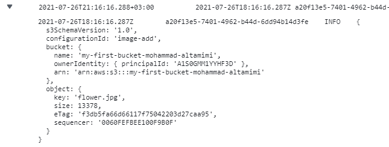

# image-lambda

<!-- ## Feature Tasks
* Create an S3 Bucket with “open” read permissions, so that anyone can see the images/files in their browser
* A user should be able to upload an image at any size, and update a dictionary of all images that have been uploaded so far
* When an image is uploaded to your S3 bucket, it should trigger a Lambda function which must:

- Download a file called “images.json” from the S3 Bucket if it exists
- The images.json should be an array of objects, each representing an image. Create an empty array if this file is not present
- Create a metadata object describing the image.
        - Name, Size, Type, etc.

- Append the data for this image to the array.
        - Note: If the image is a duplicate name, update the object in the array, don’t just add it.

* Upload the images.json file back to the S3 bucket. -->


## a description of how to use your lambda.
1. Open your AWS console.
2. Go to `Services`.
3. craete a function
4. Author from scratch.
5. Choose the language to use to write your function.(Node.js 14.x)
6. create a function

## a description of any issues you encountered during deployment of this lambda.
- an issue with deploying the images.
- NetworkOut < 2000000 for 1 datapoints within 5 minutes ?!


log >> json object of the image 

```js
2021-07-26T18:16:16.287Z	a20f13e5-7401-4962-b44d-6dd94b14d3fe	INFO	{
  s3SchemaVersion: '1.0',
  configurationId: 'image-add',
  bucket: {
    name: 'my-first-bucket-mohammad-altamimi',
    ownerIdentity: { principalId: 'A1S0GMM1YYHF3D' },
    arn: 'arn:aws:s3:::my-first-bucket-mohammad-altamimi'
  },
  object: {
    key: 'flower.jpg',
    size: 13378,
    eTag: 'f3db5fa66d66117f75042203d27caa95',
    sequencer: '0060FEFBEE100F9B0F'
  }
}
```


